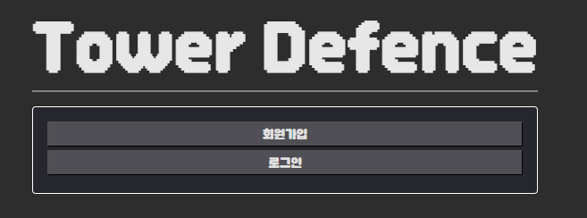
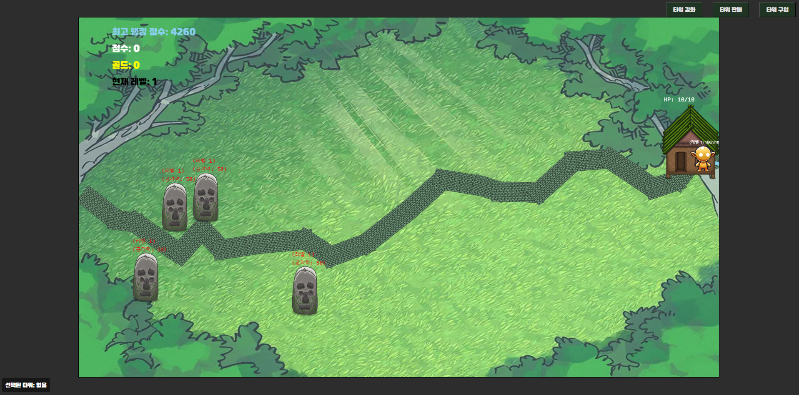

# tower-defense

[팀스파르타 Node.js 6기] 4챕터 팀 프로젝트 - 타워 디펜스

## Preview





## 파일 구조

```
📦ROOT
 ┣ 📂public
 ┃ ┣ 📂images               -   이미지 파일 묶음 폴더
 ┃ ┣ 📂src                  -   client 소스코드 묶음 폴더
 ┃ ┃ ┣ 📜base.js
 ┃ ┃ ┣ 📜button.js              -   버튼 관련 스크립트 ..
 ┃ ┃ ┣ 📜constant.js
 ┃ ┃ ┣ 📜game.js
 ┃ ┃ ┣ 📜message.js             -   메시지 관련 스크립트 ..
 ┃ ┃ ┣ 📜monster.js
 ┃ ┃ ┗ 📜tower.js
 ┃ ┣ 📂styles               -   css 파일 묶음 폴더
 ┃ ┃ ┣ 📜index.css
 ┃ ┃ ┗ 📜rank.css
 ┃ ┣ 📜index.html
 ┃ ┣ 📜login.html
 ┃ ┣ 📜register.html
 ┃ ┗ 📜room.html            -   로그인 후 대기실 브라우저
 ┣ 📂src
 ┃ ┣ 📂assets               -   게임 데이터 에셋 묶음 폴더
 ┃ ┃ ┣ 📜monster.json
 ┃ ┃ ┣ 📜monster_unlock.json
 ┃ ┃ ┣ 📜tower.json
 ┃ ┃ ┗ 📜wave.json
 ┃ ┣ 📂handlers             -   이벤트 처리 묶음 폴더
 ┃ ┃ ┣ 📜authHandler.js
 ┃ ┃ ┣ 📜broadcastHandler.js
 ┃ ┃ ┣ 📜gameHandler.js
 ┃ ┃ ┣ 📜handlerMapping.js
 ┃ ┃ ┣ 📜helper.js
 ┃ ┃ ┣ 📜mobHandler.js
 ┃ ┃ ┣ 📜rankHandler.js
 ┃ ┃ ┣ 📜registerHandler.js
 ┃ ┃ ┣ 📜stageHandler.js
 ┃ ┃ ┗ 📜towerHandler.js
 ┃ ┣ 📂init                 -   서버 초기화 세팅 묶음 폴더
 ┃ ┃ ┣ 📜assets.js
 ┃ ┃ ┗ 📜socket.js
 ┃ ┣ 📂middlewares          -   미들웨어 묶음 폴더
 ┃ ┃ ┗ 📜authMiddleware.js
 ┃ ┣ 📂models               -   게임 데이터 모델 묶음 폴더
 ┃ ┃ ┣ 📜mobCountModel.js       -   유저 별 잡은 몹 데이터
 ┃ ┃ ┣ 📜scoreModel.js          -   유저 별 스코어 데이터
 ┃ ┃ ┣ 📜stageModel.js          -   유저 별 스테이지 데이터
 ┃ ┃ ┣ 📜towerModel.js          -   유저 별 타워 데이터
 ┃ ┃ ┗ 📜userModel.js           -   유저 데이터
 ┃ ┣ 📂routes
 ┃ ┃ ┣ 📜authRoutes.js          -   인증 관련 라우터 묶음 코드
 ┃ ┃ ┗ 📜rankRoutes.js          -   랭크 관련 라우터 묶음 코드
 ┃ ┣ 📂utils
 ┃ ┃ ┣ 📜db.js                  -   mysql DB 연동
 ┃ ┃ ┣ 📜log.js                 -   log 관련 스크립트
 ┃ ┃ ┣ 📜scoreCalculation.js    -   점수 계산 스크립트
 ┃ ┃ ┗ 📜towerCalculator.js     -   타워 관련 계산 스크립트
 ┃ ┗ 📜app.js
 ┣ 📜.env
 ┣ 📜.gitattributes
 ┣ 📜.gitignore
 ┣ 📜.prettierrc
 ┣ 📜constants.js           -   허용 클라이언트, 초기 세팅에 대한 정보 스크립트
 ┣ 📜package-lock.json
 ┗ 📜package.json
```

## 구현 기능

### 필수

- [x] 회원 가입 로그인 기능

  - [x] Access Token 발급
  - [x] Access Token 기반 유저 인증

- [x] 서버로부터 데이터 동기화

  - [x] 공통 데이터 (초기 세팅)
  - [x] 유저 데이터 (몬스터 레벨, 게임 점수, 기존 최고 점수)

- [x] 이벤트 종류 정의 및 코드 구현
  - [x] 커넥션 성공 이벤트 (성공 시, 유저 등록 및 게임 시작)
  - [x] 커넥션 실패 이벤트 (실패 시, 재로그인 요청)
  - [x] 상태 동기화 이벤트 (타워 관련 동작, 몬스터 처리, 게임 시작 및 종료 시 이벤트 발생)

### 도전

- [x] 타워 환불 기능

- [x] 특정 타워 업그레이드 기능

- [x] 보물 고블린 몬스터 출현 기능

### 선택

- 스테이지 기능 추가 => 해당 웨이브에서 등장할 수 있는 모든 몬스터가 제거되면 다음 웨이브 진행 구현
- 랭크리스트 추가 => 모든 유저의 랭크를 조회하여 랭크 리스트를 출력 및 내 랭크 조회 기능 및 UI 구현
- 게임 재도전 기능 추가 => 소켓 연결을 끊지 않고 재도전 할 수 있는 기능 구현
- 게임 로그 추가 => 모든 유저의 행동 패턴 추적을 위한 로그 구현
- 타워 선택 추가 => 타워를 선택하여 업그레이드 및 환불할 수 있도록 기능 및 UI 구현
- 현황 메시지 추가 => 특정 이벤트 혹은 동작에 따른 이벤트 메시지 출력 기능 구현
- 그 외 폰트 및 UI/UX 작업 ...

## API 및 패킷 명세서

- API 명세서:

  https://www.notion.so/120a35e3ae9380a59e71da1bb5d9c2f6?v=120a35e3ae9381fe9955000cf52370fa

- 패킷 명세서:

  https://www.notion.so/120a35e3ae9380a0b97df494e5f49abb?v=120a35e3ae9381b2a7eb000c192c45da
